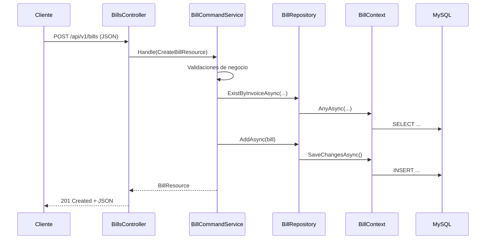

# Conocimientos de C# en el módulo `sale`

Este documento describe los conceptos de C# y del ecosistema .NET que aparecen en la carpeta `pc2/sale`, desde fundamentos hasta patrones avanzados. Cada bloque de código se explica **para qué sirve en este proyecto**, no como lista de estudio.

---

## 1. Qué hace el módulo `sale`

El módulo gestiona **facturas (bills)** de un taller/maquinarias: crear una factura vía REST, validar reglas de negocio, persistir en MySQL y devolver una representación acotada al cliente.

La estructura sigue una **arquitectura en capas** inspirada en DDD (Domain-Driven Design):

```
interfaces/REST     →  Entrada HTTP (controladores, DTOs, ensambladores)
application/        →  Casos de uso (orquestación y validación)
domain/             →  Modelo de negocio, contratos de repositorio y servicios
infrastructure/     →  Persistencia con Entity Framework Core (MySQL)
```

El arranque real (DI, base de datos, Swagger) vive en `pc2/Program.cs`, que registra los tipos definidos en `sale`.

---

## 2. Mapa de flujo (crear factura)



---

## 3. Nivel básico: bloques que ves en todo el módulo

### 3.1 Namespaces y `using`

Agrupan tipos por responsabilidad y evitan colisiones de nombres.

```csharp
namespace pc2_7420_u20231f226.sale.domain.model.agreggates;

using pc2_7420_u20231f226.sale.domain.model.valueobjects;
```

**Para qué sirve aquí:** cada carpeta (`domain`, `application`, `interfaces`) tiene su namespace; el prefijo `pc2_7420_u20231f226` coincide con el `RootNamespace` del `.csproj`, de modo que todos los ensamblados comparten la misma raíz lógica.

---

### 3.2 Clases, propiedades y valores por defecto

```csharp
public class Invoice
{
    public string SerialNumber { get; set; } = string.Empty;
    public string SequentialNumber { get; set; } = string.Empty;
}
```

| Elemento | Rol en `sale` |
|----------|----------------|
| `public class` | Tipo de referencia que agrupa datos de factura. |
| `{ get; set; }` | Propiedad autoimplementada: lectura/escritura sin campo explícito. |
| `= string.Empty` | Evita `null` en strings cuando el proyecto tiene `<Nullable>enable</Nullable>`. |

---

### 3.3 Tipos primitivos y de fecha usados en el dominio

En `bill` y en los resources aparecen:

- `int` — identificador `BillNumber`
- `string` — cliente, placa, asesor, números de factura
- `double` — `Amount` (en dominio/API; en BD se mapea a `decimal`)
- `DateTime` — emisión y auditoría (`CreatedDate`, `UpdatedDate`)
- `enum EService` — catálogo cerrado de servicios con valores numéricos fijos (10, 20, 30, 40)

```csharp
public enum EService
{
    MaintenanceService = 10,
    BodyworkAndPaint = 20,
    Accessories = 30,
    SpareParts = 40
}
```

**Para qué sirve:** el enum acota el dominio a cuatro servicios; en base de datos se guarda como entero (`HasConversion<int>()` en EF).

---

### 3.4 Herencia y clases `partial`

```csharp
// bilordersaudit.cs
public partial class bilordersaudit
{
    [Column("CreatedAt")]
    public DateTime CreatedDate { get; set; }

    [Column("UpdatedAt")]
    public DateTime UpdatedDate { get; set; }
}

// bill.cs
public partial class bill : bilordersaudit
{
    public int BillNumber { get; set; }
    // ...
}
```

**Para qué sirve:**

- **Herencia:** toda entidad de factura lleva campos de auditoría sin repetirlos en cada clase.
- **`partial`:** permite dividir la misma clase en varios archivos (útil si más adelante se genera código o se separan concerns).
- **`[Column("CreatedAt")]`:** el nombre de propiedad en C# (`CreatedDate`) no coincide con la columna SQL (`created_at` tras snake_case); el atributo de EF mapea explícitamente.

---

## 4. Nivel intermedio: API, asincronía y contratos

### 4.1 Controlador REST — plantilla de entrada HTTP

```csharp
[ApiController]
[Route("api/v1/bills")]
public class BillsController : ControllerBase
{
    private readonly IBillCommandService _commandService;

    public BillsController(IBillCommandService commandService)
    {
        _commandService = commandService;
    }

    [HttpPost]
    public async Task<IActionResult> CreateBill([FromBody] CreateBillResource resource)
    {
        try
        {
            var result = await _commandService.Handle(resource);
            return CreatedAtAction(nameof(CreateBill), new { billNumber = result.BillNumber }, result);
        }
        catch (ArgumentException ex) { return BadRequest(new { message = ex.Message }); }
        catch (InvalidOperationException ex) { return Conflict(new { message = ex.Message }); }
        catch (Exception) { return StatusCode(500, new { message = "An internal server error occurred." }); }
    }
}
```

| Bloque | Función en este endpoint |
|--------|---------------------------|
| `[ApiController]` | Convenciones API: validación automática del modelo, binding, respuestas 400 coherentes. |
| `[Route("api/v1/bills")]` | Prefijo de URL; el POST final es `POST /api/v1/bills`. |
| `ControllerBase` | Base sin vistas; solo JSON y códigos HTTP. |
| Constructor con `IBillCommandService` | **Inyección de dependencias:** ASP.NET Core crea el controlador y le pasa la implementación registrada en `Program.cs`. |
| `async Task<IActionResult>` | Operación no bloqueante mientras se espera BD/repositorio. |
| `[FromBody]` | Deserializa el JSON del cuerpo a `CreateBillResource`. |
| `CreatedAtAction(...)` | Respuesta **201 Created** con cabecera `Location` y cuerpo `BillResource`. |
| `catch` por tipo | Traduce errores de dominio/aplicación a **400**, **409** o **500**. |

---

### 4.2 DTOs (Resources) vs entidad de dominio

**`CreateBillResource`** — lo que entra por API (incluye placa y asesor).

**`BillResource`** — lo que sale tras crear (sin placa ni asesor, según requisito).

**`bill`** — entidad de dominio/persistencia con `Invoice` como objeto anidado y campos de auditoría.

Separar tipos evita exponer el modelo interno y permite validar/formatear por capa.

---

### 4.3 Interfaz de aplicación (comando)

```csharp
public interface IBillCommandService
{
    Task<BillResource> Handle(CreateBillResource resource);
}
```

**Para qué sirve:** contrato del **caso de uso** “crear factura”. El controlador depende de la abstracción, no de `BillCommandService` concreto → pruebas y sustitución de implementación más simple.

La implementación en `BillCommandService`:

1. Valida reglas (longitudes, monto, fecha, enum, unicidad de factura).
2. Construye `bill`.
3. Llama al repositorio.
4. Devuelve `BillResource` (mapeo manual en el servicio; existe también `BillResourceAssembler` como alternativa centralizada).

---

### 4.4 Repositorio — abstracción de persistencia

```csharp
public interface IbillRepository
{
    Task<bill> AddAsync(bill bill);
    Task<bool> ExistByInvoiceAsync(string serialNumber, string sequentialNumber);
    Task<bill?> GetByBillNumberAsync(int billNumber);
}
```

**Para qué sirve:** el dominio/aplicación **no conocen SQL ni `DbContext`**; solo operaciones de negocio sobre agregados. `bill?` indica que `GetByBillNumberAsync` puede no encontrar fila (nullable reference type).

Implementación típica:

```csharp
return await _context.Bills
    .AnyAsync(b => b.Invoice.SerialNumber == serialNumber &&
                   b.Invoice.SequentialNumber == sequentialNumber);
```

`AnyAsync` traduce a `EXISTS` en SQL: consulta barata para comprobar duplicados de factura.

---

### 4.5 Ensamblador estático (transformación entre capas)

```csharp
public static class BillResourceAssembler
{
    public static BillResource ToResource(bill bill) => new()
    {
        BillNumber = bill.BillNumber,
        Customer = bill.Customer,
        // Invoice aplanado en dos strings en el DTO de salida
        InvoiceSerialNumber = bill.Invoice.SerialNumber,
        InvoiceSequentialNumber = bill.Invoice.SequentialNumber,
        Amount = bill.Amount
    };

    public static bill ToEntity(CreateBillResource resource) => new()
    {
        Invoice = new Invoice { SerialNumber = resource.InvoiceSerialNumber, ... },
        CreatedDate = DateTime.UtcNow,
        UpdatedDate = DateTime.UtcNow
    };
}
```

**Para qué sirve:**

- **`static`:** no necesita estado; son funciones puras de mapeo.
- **Expresión `=> new() { ... }`:** sintaxis concisa de C# 9+ para construir objetos.
- **Aplanar `Invoice`:** en JSON de respuesta conviene `InvoiceSerialNumber` en la raíz; en dominio `Invoice` sigue siendo value object.

En el código actual, `BillCommandService` hace parte del mapeo inline; el assembler está listo para unificar criterios.

---

## 5. Nivel avanzado (profundización)

### 5.1 Entity Framework Core: `DbContext` y configuración fluida

`BillContext` es el **punto único** de configuración del modelo relacional para facturas:

```csharp
public class BillContext : DbContext
{
    public DbSet<bill> Bills => Set<bill>();

    public BillContext(DbContextOptions<BillContext> options) : base(options) { }

    protected override void OnModelCreating(ModelBuilder modelBuilder)
    {
        base.OnModelCreating(modelBuilder);
        modelBuilder.UserSnakeCaseNamingConventions();
        modelBuilder.Entity<bill>(entity => { /* Fluent API */ });
    }
}
```

#### `DbSet<bill>` y `Set<bill>()`

Expone la tabla `bills` como colección LINQ. `AddAsync`, `AnyAsync` y `SaveChangesAsync` operan sobre este set.

#### Fluent API en `OnModelCreating`

Configuración imperativa (preferida frente a atributos sueltos cuando el modelo crece):

| Configuración | Efecto técnico |
|---------------|----------------|
| `HasKey(b => b.BillNumber)` | Clave primaria. |
| `ValueGeneratedOnAdd()` | MySQL/auto-increment: el valor se genera al insertar. |
| `IsRequired()`, `HasMaxLength(n)` | Restricciones que EF refleja en migraciones/esquema. |
| `HasColumnType("decimal(18,2)")` | Precisión monetaria en BD (mejor que `double` para dinero). |
| `HasConversion<int>()` en enum | Persiste `EService` como entero, no como string. |
| `ToTable("bills")` | Nombre explícito de tabla. |

#### **Owned type** — `OwnsOne(b => b.Invoice, ...)`

```csharp
entity.OwnsOne(b => b.Invoice, invoice =>
{
    invoice.Property(i => i.SerialNumber).IsRequired().HasMaxLength(10);
    invoice.Property(i => i.SequentialNumber).IsRequired().HasMaxLength(10);
});
```

**Qué es:** en DDD, `Invoice` es un **objeto de valor** sin identidad propia; no es una tabla `invoices` con FK. EF lo embebe en la fila de `bills` (columnas como `invoice_serial_number`, según convención de nombres).

**Por qué importa:** la unicidad de negocio “misma serie + mismo correlativo” se consulta con `b.Invoice.SerialNumber` en LINQ, pero físicamente son columnas de la misma tabla.

#### Convención snake_case compartida

En `shared/Persistence/EFC/Extentions/NamingConventionsExtension.cs`:

```csharp
public static void UserSnakeCaseNamingConventions(this ModelBuilder builder)
{
    foreach (var entity in builder.Model.GetEntityTypes())
    {
        entity.SetTableName(ToSnakeCase(entity.GetTableName() ?? entity.DisplayName()));
        foreach (var property in entity.GetProperties())
            property.SetColumnName(ToSnakeCase(property.Name));
    }
}
```

**Para qué sirve en `sale`:** alinear C# (`BillNumber`) con columnas MySQL (`bill_number`) sin renombrar cada propiedad manualmente. Es un **método de extensión** sobre `ModelBuilder`: se invoca como si fuera API nativa de EF.

---

### 5.2 Inyección de dependencias y ciclo de vida

En `Program.cs`:

```csharp
builder.Services.AddDbContext<BillContext>(options =>
    options.UseMySql(builder.Configuration.GetConnectionString("DefaultConnection"),
        new MySqlServerVersion(new Version(8, 0, 34))));

builder.Services.AddScoped<IBillCommandService, BillCommandService>();
builder.Services.AddScoped<IbillRepository, BillRepository>();
```

| Registro | Lifetime | Implicación |
|----------|----------|-------------|
| `BillContext` | Scoped (por defecto en web) | Una instancia por petición HTTP; coherente con `SaveChangesAsync` en el mismo request. |
| `BillCommandService`, `BillRepository` | Scoped | Comparten el mismo `BillContext` dentro de la petición. |

**Patrón:** el controlador → servicio → repositorio → contexto forman una **cadena de dependencias unidireccional** hacia infraestructura; el dominio solo define interfaces.

---

### 5.3 Top-level statements y arranque de la aplicación

`Program.cs` usa **minimal hosting** (C# 9+):

```csharp
var builder = WebApplication.CreateBuilder(args);
// ...
var app = builder.Build();
// ...
using (var scope = app.Services.CreateScope())
{
    var context = scope.ServiceProvider.GetRequiredService<BillContext>();
    context.Database.EnsureCreated();
}
app.Run();
```

**Bloques clave:**

- `WebApplication.CreateBuilder` — configuración de host, logging, configuración (`appsettings`), DI.
- `CreateScope()` + `GetRequiredService<BillContext>()` — resuelve el contexto **fuera** de un controller para ejecutar `EnsureCreated()` al inicio (crea BD/tablas si no existen; en producción suele preferirse migraciones).
- `app.MapControllers()` — descubre `BillsController` por convención.

---

### 5.4 Async/await de punta a punta

Cadena: `CreateBill` → `Handle` → `ExistByInvoiceAsync` / `AddAsync` → `SaveChangesAsync`.

**Por qué:** liberar hilos del pool de ASP.NET mientras MySQL responde. Mezclar `.Result` o `.Wait()` en código async provocaría deadlocks; aquí el estilo es consistente.

---

### 5.5 Validación de negocio vs validación de modelo

En `BillCommandService` las reglas son **explícitas** con `throw new ArgumentException` / `InvalidOperationException`:

- Cliente y asesor obligatorios y ≤ 100 caracteres.
- Placa opcional pero ≤ 10.
- Monto > 0.
- `Emission >= DateTime.UtcNow.Date`.
- `Enum.IsDefined(typeof(EService), resource.ServiceId)` — rechaza enteros no definidos en el enum aunque el JSON deserialice.
- Duplicado de factura → `InvalidOperationException` → 409 en el controlador.

**Diseño:** la aplicación es la **frontera de reglas de negocio**; EF refuerza integridad estructural (longitudes, required) pero no sustituye reglas como “fecha no anterior a hoy”.

---

### 5.6 Swagger / OpenAPI

Atributos en el controlador:

```csharp
[SwaggerOperation(Summary = "...", Description = "...")]
[ProducesResponseType(typeof(BillResource), 201)]
[ProducesResponseType(400)]
[ProducesResponseType(409)]
```

**Para qué sirve:** documentación interactiva en desarrollo (`UseSwagger` / `UseSwaggerUI`) y contrato visible de códigos de respuesta y tipos.

---

### 5.7 Paquetes NuGet relevantes para `sale`

| Paquete | Uso en el proyecto |
|---------|-------------------|
| `Microsoft.EntityFrameworkCore` | ORM y LINQ traducible a SQL. |
| `Pomelo.EntityFrameworkCore.MySql` | Proveedor MySQL 8.x. |
| `Swashbuckle.AspNetCore` (+ Annotations) | Swagger UI y metadatos en endpoints. |
| `EntityFrameworkCore.CreatedUpdatedDate` | Referenciado en el proyecto (auditoría; en `sale` las fechas se asignan manualmente en el servicio/assembler). |

Target: **.NET 9** (`net9.0`) con `ImplicitUsings` y nullable habilitados.

---

## 6. Patrones de diseño presentes (resumen)

| Patrón | Dónde | Propósito |
|--------|-------|-----------|
| **Layered architecture** | Carpetas `interfaces`, `application`, `domain`, `infrastructure` | Separar HTTP, casos de uso, modelo y BD. |
| **Repository** | `IbillRepository` / `BillRepository` | Ocultar EF detrás de operaciones de dominio. |
| **Application service / Command** | `IBillCommandService.Handle` | Un método = un caso de uso transaccional. |
| **DTO / Resource** | `CreateBillResource`, `BillResource` | Contrato HTTP desacoplado de `bill`. |
| **Assembler** | `BillResourceAssembler` | Mapeo entity ↔ DTO centralizado. |
| **Value object** | `Invoice`, `EService` | Datos sin identidad propia o catálogo cerrado. |
| **Aggregate root** | `bill` (con auditoría heredada) | Unidad de persistencia y consistencia. |
| **Dependency injection** | Constructores + `Program.cs` | Bajo acoplamiento y testabilidad. |
| **Owned entity (EF)** | `OwnsOne(Invoice)` | Modelar value object en relacional. |

---

## 7. Fragmentos plantilla por archivo (referencia rápida)

| Archivo | Bloque central | Sirve para |
|---------|----------------|------------|
| `BillsController.cs` | POST + `CreatedAtAction` + manejo de excepciones | Exponer crear factura REST con códigos HTTP correctos. |
| `CreateBillResource.cs` / `BillResource.cs` | Propiedades públicas | Contrato JSON entrada/salida. |
| `bill.cs` / `bilordersaudit.cs` | Herencia + auditoría | Modelo de dominio persistible. |
| `Invoice.cs` / `EService.cs` | Clase simple / enum | Value object y catálogo de servicios. |
| `IbillCommandService.cs` | `Task<BillResource> Handle(...)` | Contrato del caso de uso. |
| `BillCommandService.cs` | Validaciones + `AddAsync` | Orquestar creación con reglas de negocio. |
| `IbillRepository.cs` | Métodos async | Contrato de acceso a datos. |
| `BillRepository.cs` | LINQ sobre `DbSet` | Implementación EF. |
| `billContext.cs` | `OnModelCreating` | Esquema, owned types, tipos SQL. |
| `billResourceAssembler.cs` | `ToResource` / `ToEntity` | Transformación entre capas. |
| `Program.cs` (en `pc2`) | `AddDbContext`, `AddScoped`, `EnsureCreated` | Componer y arrancar el módulo `sale`. |

---

## 8. Detalles finos que suelen generar dudas

1. **Nombres en minúscula (`bill`, `IbillRepository`):** convención del proyecto; en C# lo habitual es PascalCase, pero el comportamiento del lenguaje es el mismo.

2. **`double` en API vs `decimal` en BD:** el JSON puede traer `Amount` como número flotante; EF lo persiste como `decimal(18,2)` para reducir errores de redondeo en almacenamiento.

3. **`IBillCommandService` en `domain` pero devuelve `BillResource` (capa interfaces):** acoplamiento entre capas; en un diseño más estricto el dominio devolvería un tipo de dominio y el controlador mapearía a DTO.

4. **`EnsureCreated()` vs migraciones:** útil en desarrollo/demo; en entornos serios se usan `dotnet ef migrations` para versionar esquema.

5. **`BillResourceAssembler` vs mapeo en `BillCommandService`:** hoy coexisten; unificar evita reglas de mapeo duplicadas.

---

## 9. Conclusión

El módulo `sale` concentra un stack típico de **API REST en ASP.NET Core** + **EF Core con MySQL** + **organización tipo DDD**. Los conocimientos básicos (tipos, clases, enums) sostienen el modelo; los intermedios (async, DI, controladores, repositorios) conectan HTTP con datos; los avanzados (Fluent API, owned types, convenciones de nombres, lifetimes, command services y mapeo entre capas) son los que definen cómo se comporta el sistema en producción y cómo evoluciona sin mezclar HTTP con SQL en el mismo archivo.

Para ver el ensamblaje completo en ejecución, sigue el flujo desde `BillsController.CreateBill` hasta `BillRepository.AddAsync` y la configuración en `BillContext.OnModelCreating`.
